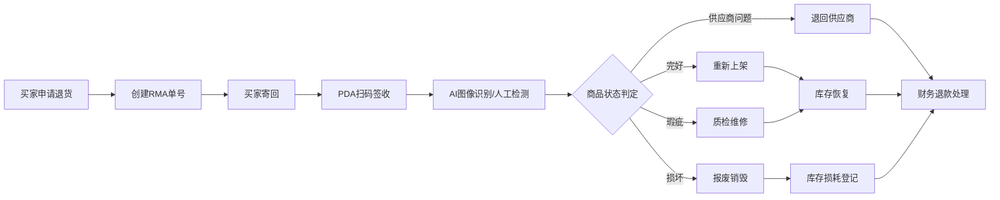
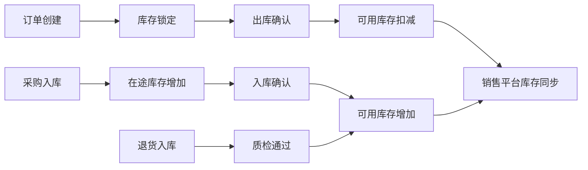

## 1. 产品概述

本平台为跨境电商多平台订单与海外仓履约一体化管理系统，实现多店铺/多平台订单统一接入、智能分仓、自动审单、WMS作业、物流面单、轨迹回传、库存同步、风控拦截、退货RMA、财务核算、数据决策全链路闭环。

以降成本、提时效、降风险、可追溯为目标，支持Amazon、Shopify、Temu、SHEIN、TikTok Shop、eBay、Walmart等主流平台，满足跨境电商发货时效、库存健康、财务精准、海关合规、风控安全管理要求。

## 2. 核心功能

### 2.1 用户角色（RBAC细粒度权限）

| 角色 | 注册方式 | 核心权限 |
|------|----------|----------|
| 客服 | 管理员创建 | 订单查询、买家沟通、异常跟进、RMA创建、轨迹查询 |
| 仓管员 | 管理员创建 | PDA拣货、打包、出库、入库、退货验收、库存盘点 |
| 运营 | 管理员创建 | 商品上下架、库存管理、分仓策略、定价、活动、数据查看 |
| 财务总监 | 管理员创建 | 利润报表、费用核算、对账、发票、成本分析、数据导出 |
| 系统管理员 | 系统初始化 | 用户管理、权限配置、系统配置、日志审计 |

### 2.2 功能模块

1. **登录认证页**：用户登录、角色选择、权限验证
2. **运营数据大屏**：实时数据展示、多维度筛选、趋势图表
3. **订单管理中心**：多平台订单列表、订单详情、智能分仓、风控审核
4. **WMS作业系统**：PDA拣货、打包、称重、出库、入库、盘点
5. **库存管理中心**：库存查询、库存调拨、采购管理、库存预警
6. **物流管理中心**：物流渠道配置、面单打印、轨迹追踪、异常预警
7. **退货RMA中心**：RMA申请、退货入库、质检判定、处置执行
8. **财务核算中心**：成本核算、利润报表、费用管理、对账管理
9. **风控管理中心**：黑名单管理、风控规则配置、风险订单处理
10. **系统管理中心**：用户管理、权限配置、日志审计、平台配置

### 2.3 页面详情

| 页面名称 | 模块名称 | 功能描述 |
|---------|----------|----------|
| 登录页 | 认证模块 | 用户登录、角色切换、双因素认证 |
| 运营大屏 | 数据可视化 | 实时订单量、销售额、发货及时率、库存周转、退货率等核心指标 |
| 订单列表 | 订单管理 | 多平台订单查询、筛选、批量操作、订单详情 |
| 订单详情 | 订单管理 | 订单完整信息、分仓记录、风控状态、操作日志 |
| 智能分仓 | 订单管理 | 自动分仓规则配置、人工调整、库存锁定 |
| 风控审核 | 风控管理 | 风险订单列表、审核操作、风险标记 |
| PDA拣货 | WMS作业 | 拣货任务、扫码校验、库位导航 |
| 打包出库 | WMS作业 | 打包校验、称重校验、面单打印、出库确认 |
| 库存查询 | 库存管理 | 实时库存、多仓库存、库存预警 |
| 库存调拨 | 库存管理 | 调拨单创建、调拨执行、在途库存 |
| 物流渠道 | 物流管理 | 渠道配置、运费模板、面单模板 |
| 轨迹追踪 | 物流管理 | 物流轨迹查询、异常预警、轨迹回传 |
| RMA列表 | 退货管理 | 退货申请、RMA单号生成、状态追踪 |
| 退货质检 | 退货管理 | 退货入库、AI质检、处置判定 |
| 利润报表 | 财务核算 | 单品/订单/店铺/月度利润分析 |
| 费用管理 | 财务核算 | 费用录入、费用分摊、成本分析 |
| 规则配置 | 系统管理 | 分仓规则、风控规则、审核规则 |
| 用户管理 | 系统管理 | 用户创建、角色分配、权限配置 |
| 操作日志 | 系统管理 | 操作记录、审计追踪、日志查询 |

## 3. 核心业务流程

### 3.1 订单履约全流程

多平台订单拉取 → 订单解析 → 风控审核 → 智能分仓 → 库存锁定 → WMS下发 → PDA拣货 → 打包校验 → 称重校验 → 面单打印 → 出库确认 → 轨迹回传 → 库存扣减 → 财务核算

### 3.2 退货RMA流程

### 3.3 库存同步流程

## 4. 用户界面设计

### 4.1 设计风格

**设计基调**：采用科技感、专业、高效的B端企业级设计风格
- **主色调**：深邃蓝 (#1E3A8A) - 代表专业、可信赖
- **辅助色**：科技青 (#0EA5E9) - 代表高效、智能
- **强调色**：警示橙 (#F97316) - 代表预警、异常
- **成功色**：翠绿 (#10B981) - 代表成功、通过
- **危险色**：警戒红 (#EF4444) - 代表危险、拦截
- **背景色**：深空灰 (#0F172A) - 深色主题，专业沉稳
- **卡片背景**：深蓝灰 (#1E293B) - 层次分明

**按钮风格**：
- 主按钮：渐变填充、圆角6px、悬浮微阴影
- 次按钮：边框填充、圆角6px
- 危险按钮：红色系渐变
- 按钮状态：hover上浮2px、active下沉效果

**字体选择**：
- 标题字体：'Noto Sans SC' - 现代感、清晰易读
- 数字字体：'JetBrains Mono' - 等宽数字，数据展示更专业
- 字体层级：H1 28px / H2 20px / H3 16px / 正文 14px / 辅助 12px

**布局风格**：
- 左侧导航栏 + 顶部状态栏 + 主内容区
- 卡片式布局，信息分组清晰
- 数据表格采用斑马线条纹
- 图表采用ECharts专业图表库

**图标风格**：
- 线性图标，简洁专业
- 状态图标采用颜色编码
- 数据图标采用动态微动画

### 4.2 页面设计概览

| 页面名称 | 模块名称 | UI元素 |
|---------|----------|--------|
| 登录页 | 登录表单 | 深色渐变背景、品牌logo、表单卡片、动效登录按钮 |
| 运营大屏 | 数据可视化 | 暗黑主题、大尺寸数字卡片、动态图表、实时数据流 |
| 订单列表 | 数据表格 | 多条件筛选器、状态标签、批量操作栏、分页器 |
| 订单详情 | 详情页 | 左右分栏布局、时间轴进度条、操作日志、关联信息 |
| PDA作业 | 移动端 | 大按钮、扫码区域、状态提示音反馈 |
| 库存管理 | 数据看板 | 库存卡片、预警标识、调拨进度 |
| 财务报表 | 图表分析 | 多维度图表、数据钻取、导出功能 |

### 4.3 响应式设计

- **桌面端优先**：1920px / 1440px / 1024px 适配
- **平板端适配**：侧边栏可折叠，内容区自适应
- **移动端**：PDA作业界面专门优化，大按钮、大字体、适合手持操作
- **触控优化**：按钮最小尺寸44x44px，适合PDA扫码操作

### 4.4 交互动效设计

- **页面加载**：骨架屏预加载，元素淡入
- **数据更新**：数字滚动动画、图表渐进渲染
- **状态变更**：状态标签颜色过渡动画
- **操作反馈**：按钮点击波纹效果、成功/失败Toast提示
- **导航切换**：平滑过渡动画
- **预警提示**：呼吸灯效果、震动反馈

### 4.5 核心强规则视觉体现

- 未审核订单显示红色锁定图标，禁止操作
- PDA扫码失败强震动+红色闪烁提示
- 重量异常弹窗强制弹窗，必须人工确认
- 操作日志时间轴，全程可追溯
