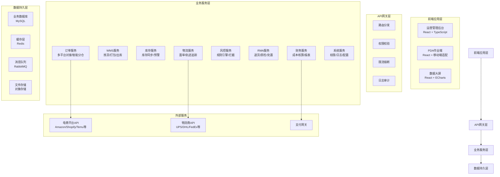
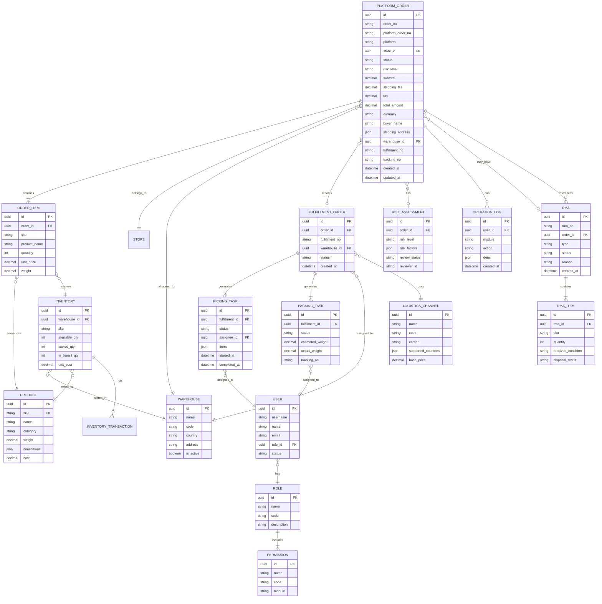

## 1. 架构设计



## 2. 技术选型

### 2.1 前端技术栈
- **框架**: React@18 + TypeScript@5
- **构建工具**: Vite@5
- **样式方案**: TailwindCSS@3 + CSS Variables
- **状态管理**: Zustand@4（轻量级，性能优异）
- **路由管理**: React Router@6
- **UI组件**: 自定义组件库 + Ant Design@5（按需引入）
- **图表库**: ECharts@5
- **HTTP客户端**: Axios + 请求拦截器
- **日期处理**: Day.js
- **表单校验**: React Hook Form + Zod
- **图标库**: Lucide React

### 2.2 Mock数据方案
- **工具**: MSW@2 (Mock Service Worker) + Faker.js
- **数据层**: 本地JSON + Mock API模拟后端接口
- **持久化**: LocalStorage 模拟数据持久化

### 2.3 性能优化
- 代码分割：React.lazy + Suspense 路由懒加载
- 虚拟列表：react-window 处理大数据表格
- 缓存策略：SWR 数据缓存与自动刷新
- 构建优化：Tree Shaking + 按需加载 + Gzip压缩

## 3. 路由定义

| 路由路径 | 页面名称 | 权限要求 | 说明 |
|---------|---------|---------|------|
| /login | 登录页 | 公开 | 用户登录认证 |
| /dashboard | 运营大屏 | 运营/财务/管理员 | 实时数据展示 |
| /orders | 订单列表 | 客服/运营/管理员 | 多平台订单管理 |
| /orders/:id | 订单详情 | 客服/运营/管理员 | 订单完整信息 |
| /orders/audit | 风控审核 | 运营/管理员 | 风险订单审核 |
| /wms/picking | PDA拣货 | 仓管员 | 拣货作业界面 |
| /wms/packing | 打包出库 | 仓管员 | 打包称重出库 |
| /wms/receiving | 入库验收 | 仓管员 | 采购/退货入库 |
| /inventory | 库存查询 | 运营/管理员 | 多仓库存查询 |
| /inventory/transfer | 库存调拨 | 运营/管理员 | 跨仓调拨管理 |
| /logistics/channels | 物流渠道 | 运营/管理员 | 物流渠道配置 |
| /logistics/tracking | 轨迹追踪 | 客服/运营/管理员 | 物流轨迹查询 |
| /rma | RMA列表 | 客服/运营/管理员 | 退货申请管理 |
| /rma/inspect | 退货质检 | 仓管员/运营 | 退货质检判定 |
| /finance/profit | 利润报表 | 财务/管理员 | 多维度利润分析 |
| /finance/expense | 费用管理 | 财务/管理员 | 费用录入分摊 |
| /risk/rules | 风控规则 | 管理员 | 风控规则配置 |
| /system/users | 用户管理 | 管理员 | 用户权限管理 |
| /system/logs | 操作日志 | 管理员 | 操作审计追踪 |
| /system/config | 系统配置 | 管理员 | 系统参数配置 |

## 4. API接口定义

### 4.1 通用响应结构

```typescript
interface ApiResponse<T> {
  code: number;
  message: string;
  data: T;
  timestamp: number;
}

interface PageResponse<T> {
  list: T[];
  total: number;
  page: number;
  pageSize: number;
}
```

### 4.2 订单相关接口

```typescript
// 订单查询
GET /api/orders?page=1&pageSize=20&platform=amazon&status=pending
Response: ApiResponse<PageResponse<Order>>

// 订单详情
GET /api/orders/:id
Response: ApiResponse<OrderDetail>

// 订单创建
POST /api/orders
Request: OrderCreateRequest
Response: ApiResponse<Order>

// 订单审核
PUT /api/orders/:id/audit
Request: { status: 'approved' | 'rejected'; remark: string }
Response: ApiResponse<Order>

// 智能分仓
POST /api/orders/:id/allocate-warehouse
Request: { warehouseId?: string }
Response: ApiResponse<AllocationResult>

// 订单发货
PUT /api/orders/:id/ship
Request: { trackingNo: string; logisticsId: string; weight: number }
Response: ApiResponse<Order>

// 订单类型定义
interface Order {
  id: string;
  orderNo: string;
  platformOrderNo: string;
  platform: 'amazon' | 'shopify' | 'temu' | 'tiktok' | 'ebay' | 'walmart' | 'shein';
  storeId: string;
  storeName: string;
  status: 'pending' | 'risk_review' | 'allocated' | 'picking' | 'packing' | 'shipped' | 'delivered' | 'cancelled' | 'returned';
  riskLevel: 'low' | 'medium' | 'high';
  buyerName: string;
  buyerEmail: string;
  buyerPhone: string;
  shippingAddress: Address;
  items: OrderItem[];
  subtotal: number;
  shippingFee: number;
  tax: number;
  totalAmount: number;
  currency: string;
  paymentStatus: 'unpaid' | 'paid' | 'refunded' | 'partial_refunded';
  shippingMethod: string;
  warehouseId?: string;
  warehouseName?: string;
  trackingNo?: string;
  logisticsId?: string;
  logisticsName?: string;
  fulfillmentNo?: string;
  estimatedWeight?: number;
  actualWeight?: number;
  createdAt: string;
  updatedAt: string;
  shippedAt?: string;
  deliveredAt?: string;
}

interface OrderItem {
  id: string;
  sku: string;
  productName: string;
  quantity: number;
  unitPrice: number;
  weight: number;
  dimensions: { length: number; width: number; height: number };
  warehouseLocation?: string;
  pickedQuantity?: number;
  packedQuantity?: number;
}

interface Address {
  country: string;
  state: string;
  city: string;
  address1: string;
  address2?: string;
  zipCode: string;
}
```

### 4.3 WMS作业接口

```typescript
// 获取拣货任务
GET /api/wms/picking-tasks?warehouseId=xxx&status=pending
Response: ApiResponse<PickingTask[]>

// 开始拣货
PUT /api/wms/picking-tasks/:id/start
Response: ApiResponse<PickingTask>

// 拣货扫码
POST /api/wms/picking-tasks/:id/scan
Request: { sku: string; quantity: number; location: string }
Response: ApiResponse<{ success: boolean; message: string; currentProgress: number }>

// 完成拣货
PUT /api/wms/picking-tasks/:id/complete
Response: ApiResponse<PickingTask>

// 获取打包任务
GET /api/wms/packing-tasks?warehouseId=xxx
Response: ApiResponse<PackingTask[]>

// 打包校验
POST /api/wms/packing-tasks/:id/verify
Request: { items: Array<{ sku: string; quantity: number }> }
Response: ApiResponse<{ success: boolean; discrepancies: PackingDiscrepancy[] }>

// 称重校验
POST /api/wms/packing-tasks/:id/weigh
Request: { actualWeight: number }
Response: ApiResponse<{ success: boolean; deviation: number; needsReview: boolean }>

// 打印面单
POST /api/wms/packing-tasks/:id/print-label
Request: { logisticsId: string }
Response: ApiResponse<{ labelUrl: string; trackingNo: string }>

// 确认出库
PUT /api/wms/packing-tasks/:id/ship
Response: ApiResponse<{ success: boolean }>
```

### 4.4 库存相关接口

```typescript
// 库存查询
GET /api/inventory?sku=xxx&warehouseId=xxx
Response: ApiResponse<PageResponse<Inventory>>

// 库存详情
GET /api/inventory/:sku
Response: ApiResponse<InventoryDetail>

// 库存锁定
POST /api/inventory/:sku/lock
Request: { quantity: number; warehouseId: string; orderId: string }
Response: ApiResponse<{ success: boolean; availableAfter: number }>

// 库存扣减
POST /api/inventory/:sku/deduct
Request: { quantity: number; warehouseId: string; orderId: string }
Response: ApiResponse<{ success: boolean }>

// 库存入库
POST /api/inventory/:sku/add
Request: { quantity: number; warehouseId: string; referenceNo: string; type: 'purchase' | 'return' | 'transfer' }
Response: ApiResponse<{ success: boolean; totalAfter: number }>

// 库存调拨
POST /api/inventory/transfer
Request: { sku: string; quantity: number; fromWarehouseId: string; toWarehouseId: string }
Response: ApiResponse<TransferOrder>

interface Inventory {
  id: string;
  sku: string;
  productName: string;
  warehouseId: string;
  warehouseName: string;
  availableQuantity: number;
  lockedQuantity: number;
  inTransitQuantity: number;
  reservedQuantity: number;
  totalQuantity: number;
  unitCost: number;
  currency: string;
  lastUpdated: string;
  alertLevel: number;
  isLowStock: boolean;
}
```

### 4.5 风控相关接口

```typescript
// 获取风险订单
GET /api/risk/orders?level=high
Response: ApiResponse<PageResponse<RiskOrder>>

// 风控审核
PUT /api/risk/orders/:id/review
Request: { decision: 'approve' | 'reject' | 'hold'; remark: string }
Response: ApiResponse<RiskOrder>

// 风控规则列表
GET /api/risk/rules
Response: ApiResponse<RiskRule[]>

// 更新风控规则
PUT /api/risk/rules/:id
Request: RiskRuleUpdateRequest
Response: ApiResponse<RiskRule>

// 黑名单管理
GET /api/risk/blacklist
Response: ApiResponse<PageResponse<BlacklistItem>>

POST /api/risk/blacklist
Request: { type: 'buyer' | 'ip' | 'address'; value: string; reason: string }
Response: ApiResponse<BlacklistItem>
```

### 4.6 RMA相关接口

```typescript
// RMA列表
GET /api/rma?status=pending
Response: ApiResponse<PageResponse<RMA>>

// 创建RMA
POST /api/rma
Request: { orderId: string; reason: string; items: RMAItem[] }
Response: ApiResponse<RMA>

// RMA详情
GET /api/rma/:id
Response: ApiResponse<RMADetail>

// 退货入库
PUT /api/rma/:id/receive
Request: { items: Array<{ rmaItemId: string; receivedQuantity: number; condition: 'good' | 'damaged' | 'missing' }> }
Response: ApiResponse<RMA>

// 质检判定
PUT /api/rma/:id/inspect
Request: { items: Array<{ rmaItemId: string; inspectionResult: 'restock' | 'repair' | 'destroy' | 'return_to_supplier'; remark: string }> }
Response: ApiResponse<RMA>

// 执行处置
PUT /api/rma/:id/process
Request: { items: Array<{ rmaItemId: string; processedQuantity: number }> }
Response: ApiResponse<RMA>

interface RMA {
  id: string;
  rmaNo: string;
  orderId: string;
  orderNo: string;
  status: 'pending' | 'approved' | 'shipped' | 'received' | 'inspected' | 'processed' | 'closed';
  reason: string;
  type: 'refund' | 'exchange' | 'repair';
  buyerName: string;
  items: RMAItem[];
  createdAt: string;
}
```

### 4.7 财务相关接口

```typescript
// 利润报表
GET /api/finance/profit?dimension=order&startDate=xxx&endDate=xxx
Response: ApiResponse<ProfitReport>

// 订单成本明细
GET /api/finance/orders/:id/cost
Response: ApiResponse<OrderCostDetail>

// 费用列表
GET /api/finance/expenses
Response: ApiResponse<PageResponse<Expense>>

// 费用录入
POST /api/finance/expenses
Request: ExpenseCreateRequest
Response: ApiResponse<Expense>

// 对账管理
GET /api/finance/reconciliation?platform=amazon&month=2024-01
Response: ApiResponse<ReconciliationResult>

interface OrderCostDetail {
  orderId: string;
  orderNo: string;
  revenue: number;
  costs: {
    productCost: number;
    firstMileShipping: number;
    warehouseStorageFee: number;
    lastMileShipping: number;
    platformCommission: number;
    transactionFee: number;
    promotionFee: number;
    tax: number;
    otherCost: number;
  };
  totalCost: number;
  profit: number;
  profitMargin: number;
}
```

### 4.8 认证与系统接口

```typescript
// 登录
POST /api/auth/login
Request: { username: string; password: string }
Response: ApiResponse<{ token: string; user: User; permissions: string[] }>

// 获取当前用户
GET /api/auth/me
Response: ApiResponse<User>

// 操作日志
GET /api/system/logs
Response: ApiResponse<PageResponse<OperationLog>>

// 用户管理
GET /api/system/users
Response: ApiResponse<PageResponse<User>>

POST /api/system/users
Request: UserCreateRequest
Response: ApiResponse<User>

PUT /api/system/users/:id
Request: UserUpdateRequest
Response: ApiResponse<User>

// 角色权限
GET /api/system/roles
Response: ApiResponse<Role[]>

interface User {
  id: string;
  username: string;
  name: string;
  email: string;
  role: 'admin' | 'operation' | 'warehouse' | 'customer_service' | 'finance';
  roleName: string;
  permissions: string[];
  status: 'active' | 'inactive';
  createdAt: string;
}
```

## 5. 数据模型设计

### 5.1 实体关系图 (ER Diagram)



### 5.2 数据库DDL (核心表)

```sql
-- 平台订单表
CREATE TABLE platform_orders (
    id UUID PRIMARY KEY DEFAULT gen_random_uuid(),
    order_no VARCHAR(50) UNIQUE NOT NULL,
    platform_order_no VARCHAR(100) NOT NULL,
    platform VARCHAR(20) NOT NULL,
    store_id UUID NOT NULL,
    status VARCHAR(30) NOT NULL DEFAULT 'pending',
    risk_level VARCHAR(20) NOT NULL DEFAULT 'low',
    subtotal DECIMAL(12,2) NOT NULL,
    shipping_fee DECIMAL(12,2) DEFAULT 0,
    tax DECIMAL(12,2) DEFAULT 0,
    total_amount DECIMAL(12,2) NOT NULL,
    currency VARCHAR(3) NOT NULL DEFAULT 'USD',
    buyer_name VARCHAR(100) NOT NULL,
    buyer_email VARCHAR(100),
    buyer_phone VARCHAR(30),
    shipping_address JSONB NOT NULL,
    payment_status VARCHAR(20) NOT NULL DEFAULT 'unpaid',
    warehouse_id UUID,
    fulfillment_no VARCHAR(50),
    tracking_no VARCHAR(100),
    logistics_id UUID,
    estimated_weight DECIMAL(8,2),
    actual_weight DECIMAL(8,2),
    risk_reviewed_at TIMESTAMP,
    risk_reviewer_id UUID,
    allocated_at TIMESTAMP,
    shipped_at TIMESTAMP,
    delivered_at TIMESTAMP,
    created_at TIMESTAMP NOT NULL DEFAULT CURRENT_TIMESTAMP,
    updated_at TIMESTAMP NOT NULL DEFAULT CURRENT_TIMESTAMP,
    INDEX idx_platform_status (platform, status),
    INDEX idx_warehouse_status (warehouse_id, status),
    INDEX idx_created_at (created_at),
    INDEX idx_order_no (order_no),
    INDEX idx_platform_order_no (platform_order_no)
);

-- 订单项表
CREATE TABLE order_items (
    id UUID PRIMARY KEY DEFAULT gen_random_uuid(),
    order_id UUID NOT NULL REFERENCES platform_orders(id),
    sku VARCHAR(50) NOT NULL,
    product_name VARCHAR(200) NOT NULL,
    quantity INT NOT NULL,
    unit_price DECIMAL(12,2) NOT NULL,
    weight DECIMAL(8,2),
    dimensions JSONB,
    warehouse_location VARCHAR(50),
    picked_quantity INT DEFAULT 0,
    packed_quantity INT DEFAULT 0,
    created_at TIMESTAMP NOT NULL DEFAULT CURRENT_TIMESTAMP,
    INDEX idx_order_id (order_id),
    INDEX idx_sku (sku)
);

-- 仓库表
CREATE TABLE warehouses (
    id UUID PRIMARY KEY DEFAULT gen_random_uuid(),
    name VARCHAR(100) NOT NULL,
    code VARCHAR(20) UNIQUE NOT NULL,
    country VARCHAR(50) NOT NULL,
    state VARCHAR(50),
    city VARCHAR(50),
    address TEXT,
    zip_code VARCHAR(20),
    is_active BOOLEAN NOT NULL DEFAULT TRUE,
    capacity INT,
    created_at TIMESTAMP NOT NULL DEFAULT CURRENT_TIMESTAMP
);

-- 库存表
CREATE TABLE inventory (
    id UUID PRIMARY KEY DEFAULT gen_random_uuid(),
    warehouse_id UUID NOT NULL REFERENCES warehouses(id),
    sku VARCHAR(50) NOT NULL,
    product_name VARCHAR(200) NOT NULL,
    available_quantity INT NOT NULL DEFAULT 0,
    locked_quantity INT NOT NULL DEFAULT 0,
    in_transit_quantity INT NOT NULL DEFAULT 0,
    reserved_quantity INT NOT NULL DEFAULT 0,
    unit_cost DECIMAL(12,2) NOT NULL,
    currency VARCHAR(3) NOT NULL DEFAULT 'USD',
    alert_level INT DEFAULT 10,
    last_updated TIMESTAMP NOT NULL DEFAULT CURRENT_TIMESTAMP,
    UNIQUE(warehouse_id, sku),
    INDEX idx_sku (sku),
    INDEX idx_warehouse_sku (warehouse_id, sku)
);

-- 库存变动流水表
CREATE TABLE inventory_transactions (
    id UUID PRIMARY KEY DEFAULT gen_random_uuid(),
    inventory_id UUID NOT NULL REFERENCES inventory(id),
    warehouse_id UUID NOT NULL,
    sku VARCHAR(50) NOT NULL,
    type VARCHAR(30) NOT NULL,
    change_quantity INT NOT NULL,
    balance_before INT NOT NULL,
    balance_after INT NOT NULL,
    reference_type VARCHAR(50),
    reference_id UUID,
    reference_no VARCHAR(100),
    remark VARCHAR(500),
    operator_id UUID,
    created_at TIMESTAMP NOT NULL DEFAULT CURRENT_TIMESTAMP,
    INDEX idx_inventory_id (inventory_id),
    INDEX idx_sku_created (sku, created_at),
    INDEX idx_reference (reference_type, reference_id)
);

-- 履约单表
CREATE TABLE fulfillment_orders (
    id UUID PRIMARY KEY DEFAULT gen_random_uuid(),
    order_id UUID NOT NULL REFERENCES platform_orders(id),
    fulfillment_no VARCHAR(50) UNIQUE NOT NULL,
    warehouse_id UUID NOT NULL REFERENCES warehouses(id),
    status VARCHAR(30) NOT NULL DEFAULT 'created',
    priority INT DEFAULT 0,
    wave_no VARCHAR(50),
    assignee_id UUID,
    started_at TIMESTAMP,
    completed_at TIMESTAMP,
    created_at TIMESTAMP NOT NULL DEFAULT CURRENT_TIMESTAMP,
    INDEX idx_order_id (order_id),
    INDEX idx_warehouse_status (warehouse_id, status)
);

-- 拣货任务表
CREATE TABLE picking_tasks (
    id UUID PRIMARY KEY DEFAULT gen_random_uuid(),
    fulfillment_id UUID NOT NULL REFERENCES fulfillment_orders(id),
    warehouse_id UUID NOT NULL,
    status VARCHAR(30) NOT NULL DEFAULT 'pending',
    assignee_id UUID,
    items JSONB NOT NULL,
    pick_path JSONB,
    started_at TIMESTAMP,
    completed_at TIMESTAMP,
    created_at TIMESTAMP NOT NULL DEFAULT CURRENT_TIMESTAMP,
    INDEX idx_fulfillment_id (fulfillment_id),
    INDEX idx_assignee_status (assignee_id, status)
);

-- 打包任务表
CREATE TABLE packing_tasks (
    id UUID PRIMARY KEY DEFAULT gen_random_uuid(),
    fulfillment_id UUID NOT NULL REFERENCES fulfillment_orders(id),
    warehouse_id UUID NOT NULL,
    status VARCHAR(30) NOT NULL DEFAULT 'pending',
    items JSONB NOT NULL,
    estimated_weight DECIMAL(8,2),
    actual_weight DECIMAL(8,2),
    weight_deviation DECIMAL(5,2),
    weight_needs_review BOOLEAN DEFAULT FALSE,
    weight_reviewed_by UUID,
    tracking_no VARCHAR(100),
    logistics_id UUID,
    label_url VARCHAR(500),
    assignee_id UUID,
    packed_at TIMESTAMP,
    shipped_at TIMESTAMP,
    created_at TIMESTAMP NOT NULL DEFAULT CURRENT_TIMESTAMP,
    INDEX idx_fulfillment_id (fulfillment_id),
    INDEX idx_tracking_no (tracking_no)
);

-- RMA表
CREATE TABLE rma_orders (
    id UUID PRIMARY KEY DEFAULT gen_random_uuid(),
    rma_no VARCHAR(50) UNIQUE NOT NULL,
    order_id UUID NOT NULL REFERENCES platform_orders(id),
    type VARCHAR(20) NOT NULL,
    status VARCHAR(30) NOT NULL DEFAULT 'pending',
    reason TEXT NOT NULL,
    return_tracking_no VARCHAR(100),
    received_at TIMESTAMP,
    inspected_at TIMESTAMP,
    processed_at TIMESTAMP,
    closed_at TIMESTAMP,
    created_at TIMESTAMP NOT NULL DEFAULT CURRENT_TIMESTAMP,
    INDEX idx_order_id (order_id),
    INDEX idx_status (status),
    INDEX idx_created_at (created_at)
);

-- RMA明细表
CREATE TABLE rma_items (
    id UUID PRIMARY KEY DEFAULT gen_random_uuid(),
    rma_id UUID NOT NULL REFERENCES rma_orders(id),
    order_item_id UUID NOT NULL REFERENCES order_items(id),
    sku VARCHAR(50) NOT NULL,
    requested_quantity INT NOT NULL,
    received_quantity INT DEFAULT 0,
    received_condition VARCHAR(20),
    inspection_result VARCHAR(30),
    disposal_result VARCHAR(30),
    processed_quantity INT DEFAULT 0,
    remark TEXT,
    created_at TIMESTAMP NOT NULL DEFAULT CURRENT_TIMESTAMP
);

-- 风控评估表
CREATE TABLE risk_assessments (
    id UUID PRIMARY KEY DEFAULT gen_random_uuid(),
    order_id UUID NOT NULL REFERENCES platform_orders(id),
    risk_level VARCHAR(20) NOT NULL,
    risk_score INT,
    risk_factors JSONB,
    review_status VARCHAR(20) NOT NULL DEFAULT 'pending',
    reviewer_id UUID,
    review_remark TEXT,
    reviewed_at TIMESTAMP,
    created_at TIMESTAMP NOT NULL DEFAULT CURRENT_TIMESTAMP,
    INDEX idx_order_id (order_id),
    INDEX idx_review_status (review_status)
);

-- 黑名单表
CREATE TABLE blacklist (
    id UUID PRIMARY KEY DEFAULT gen_random_uuid(),
    type VARCHAR(20) NOT NULL,
    value VARCHAR(200) NOT NULL,
    reason TEXT,
    added_by UUID,
    is_active BOOLEAN NOT NULL DEFAULT TRUE,
    created_at TIMESTAMP NOT NULL DEFAULT CURRENT_TIMESTAMP,
    UNIQUE(type, value),
    INDEX idx_type_value (type, value)
);

-- 物流渠道表
CREATE TABLE logistics_channels (
    id UUID PRIMARY KEY DEFAULT gen_random_uuid(),
    name VARCHAR(100) NOT NULL,
    code VARCHAR(30) UNIQUE NOT NULL,
    carrier VARCHAR(50) NOT NULL,
    api_config JSONB,
    supported_countries TEXT[],
    base_price DECIMAL(10,2),
    price_per_kg DECIMAL(10,2),
    estimated_days_min INT,
    estimated_days_max INT,
    is_active BOOLEAN NOT NULL DEFAULT TRUE,
    created_at TIMESTAMP NOT NULL DEFAULT CURRENT_TIMESTAMP
);

-- 物流轨迹表
CREATE TABLE tracking_events (
    id UUID PRIMARY KEY DEFAULT gen_random_uuid(),
    tracking_no VARCHAR(100) NOT NULL,
    order_id UUID REFERENCES platform_orders(id),
    event_code VARCHAR(50),
    event_description TEXT,
    location VARCHAR(200),
    event_time TIMESTAMP NOT NULL,
    is_exception BOOLEAN DEFAULT FALSE,
    created_at TIMESTAMP NOT NULL DEFAULT CURRENT_TIMESTAMP,
    INDEX idx_tracking_no (tracking_no),
    INDEX idx_order_id (order_id)
);

-- 用户表
CREATE TABLE users (
    id UUID PRIMARY KEY DEFAULT gen_random_uuid(),
    username VARCHAR(50) UNIQUE NOT NULL,
    password_hash VARCHAR(255) NOT NULL,
    name VARCHAR(100) NOT NULL,
    email VARCHAR(100),
    phone VARCHAR(30),
    role_id UUID NOT NULL REFERENCES roles(id),
    warehouse_id UUID,
    status VARCHAR(20) NOT NULL DEFAULT 'active',
    last_login_at TIMESTAMP,
    created_at TIMESTAMP NOT NULL DEFAULT CURRENT_TIMESTAMP
);

-- 角色表
CREATE TABLE roles (
    id UUID PRIMARY KEY DEFAULT gen_random_uuid(),
    name VARCHAR(50) NOT NULL,
    code VARCHAR(30) UNIQUE NOT NULL,
    description TEXT,
    created_at TIMESTAMP NOT NULL DEFAULT CURRENT_TIMESTAMP
);

-- 权限表
CREATE TABLE permissions (
    id UUID PRIMARY KEY DEFAULT gen_random_uuid(),
    name VARCHAR(100) NOT NULL,
    code VARCHAR(50) UNIQUE NOT NULL,
    module VARCHAR(50) NOT NULL,
    description TEXT,
    created_at TIMESTAMP NOT NULL DEFAULT CURRENT_TIMESTAMP
);

-- 角色权限关联表
CREATE TABLE role_permissions (
    role_id UUID NOT NULL REFERENCES roles(id),
    permission_id UUID NOT NULL REFERENCES permissions(id),
    created_at TIMESTAMP NOT NULL DEFAULT CURRENT_TIMESTAMP,
    PRIMARY KEY (role_id, permission_id)
);

-- 操作日志表
CREATE TABLE operation_logs (
    id UUID PRIMARY KEY DEFAULT gen_random_uuid(),
    user_id UUID NOT NULL REFERENCES users(id),
    module VARCHAR(50) NOT NULL,
    action VARCHAR(50) NOT NULL,
    target_type VARCHAR(50),
    target_id UUID,
    detail JSONB,
    ip_address VARCHAR(50),
    user_agent VARCHAR(500),
    created_at TIMESTAMP NOT NULL DEFAULT CURRENT_TIMESTAMP,
    INDEX idx_user_id (user_id),
    INDEX idx_module_action (module, action),
    INDEX idx_target (target_type, target_id),
    INDEX idx_created_at (created_at)
);

-- 财务费用表
CREATE TABLE expenses (
    id UUID PRIMARY KEY DEFAULT gen_random_uuid(),
    type VARCHAR(50) NOT NULL,
    category VARCHAR(50) NOT NULL,
    amount DECIMAL(12,2) NOT NULL,
    currency VARCHAR(3) NOT NULL DEFAULT 'USD',
    order_id UUID REFERENCES platform_orders(id),
    sku VARCHAR(50),
    warehouse_id UUID REFERENCES warehouses(id),
    description TEXT,
    incurred_at TIMESTAMP NOT NULL,
    created_by UUID NOT NULL,
    created_at TIMESTAMP NOT NULL DEFAULT CURRENT_TIMESTAMP,
    INDEX idx_type_category (type, category),
    INDEX idx_order_id (order_id),
    INDEX idx_incurred_at (incurred_at)
);

-- 商品表
CREATE TABLE products (
    id UUID PRIMARY KEY DEFAULT gen_random_uuid(),
    sku VARCHAR(50) UNIQUE NOT NULL,
    name VARCHAR(200) NOT NULL,
    category VARCHAR(100),
    brand VARCHAR(100),
    weight DECIMAL(8,2),
    dimensions JSONB,
    unit_cost DECIMAL(12,2) NOT NULL,
    currency VARCHAR(3) NOT NULL DEFAULT 'USD',
    hs_code VARCHAR(30),
    declared_value DECIMAL(12,2),
    is_active BOOLEAN NOT NULL DEFAULT TRUE,
    created_at TIMESTAMP NOT NULL DEFAULT CURRENT_TIMESTAMP
);

-- 店铺表
CREATE TABLE stores (
    id UUID PRIMARY KEY DEFAULT gen_random_uuid(),
    platform VARCHAR(20) NOT NULL,
    store_name VARCHAR(100) NOT NULL,
    store_url VARCHAR(500),
    api_credentials JSONB,
    is_active BOOLEAN NOT NULL DEFAULT TRUE,
    last_sync_at TIMESTAMP,
    created_at TIMESTAMP NOT NULL DEFAULT CURRENT_TIMESTAMP
);
```

## 6. 前端架构设计

### 6.1 目录结构

```
src/
├── @types/                  # TypeScript类型定义
│   ├── api.ts              # API响应类型
│   ├── order.ts            # 订单相关类型
│   ├── inventory.ts        # 库存相关类型
│   ├── wms.ts              # WMS相关类型
│   ├── rma.ts              # RMA相关类型
│   ├── finance.ts          # 财务相关类型
│   ├── risk.ts             # 风控相关类型
│   └── system.ts           # 系统相关类型
├── api/                     # API接口层
│   ├── client.ts           # Axios实例配置
│   ├── order.ts            # 订单API
│   ├── inventory.ts        # 库存API
│   ├── wms.ts              # WMS API
│   ├── logistics.ts        # 物流API
│   ├── rma.ts              # RMA API
│   ├── finance.ts          # 财务API
│   ├── risk.ts             # 风控API
│   └── system.ts           # 系统API
├── components/              # 公共组件
│   ├── layout/             # 布局组件
│   │   ├── MainLayout.tsx
│   │   ├── Sidebar.tsx
│   │   ├── Header.tsx
│   │   └── Breadcrumb.tsx
│   ├── common/             # 通用组件
│   │   ├── DataTable.tsx
│   │   ├── StatusBadge.tsx
│   │   ├── PageHeader.tsx
│   │   ├── SearchForm.tsx
│   │   ├── Loading.tsx
│   │   └── Empty.tsx
│   ├── charts/             # 图表组件
│   │   ├── LineChart.tsx
│   │   ├── BarChart.tsx
│   │   └── PieChart.tsx
│   └── form/               # 表单组件
│       ├── FormInput.tsx
│       ├── FormSelect.tsx
│       └── FormDatePicker.tsx
├── hooks/                   # 自定义Hooks
│   ├── useAuth.ts          # 认证Hook
│   ├── usePermission.ts    # 权限Hook
│   ├── useTable.ts         # 表格Hook
│   └── useNotification.ts  # 通知Hook
├── store/                   # 状态管理
│   ├── useAuthStore.ts     # 认证状态
│   ├── useAppStore.ts      # 应用状态
│   └── useOrderStore.ts    # 订单状态
├── pages/                   # 页面组件
│   ├── Login.tsx           # 登录页
│   ├── Dashboard.tsx       # 运营大屏
│   ├── orders/             # 订单模块
│   │   ├── OrderList.tsx
│   │   ├── OrderDetail.tsx
│   │   └── OrderAudit.tsx
│   ├── wms/                # WMS模块
│   │   ├── PickingTask.tsx
│   │   ├── PackingTask.tsx
│   │   └── Receiving.tsx
│   ├── inventory/          # 库存模块
│   │   ├── InventoryList.tsx
│   │   └── TransferOrder.tsx
│   ├── logistics/          # 物流模块
│   │   ├── ChannelConfig.tsx
│   │   └── Tracking.tsx
│   ├── rma/                # RMA模块
│   │   ├── RMAList.tsx
│   │   └── Inspection.tsx
│   ├── finance/            # 财务模块
│   │   ├── ProfitReport.tsx
│   │   └── ExpenseManage.tsx
│   ├── risk/               # 风控模块
│   │   ├── RiskOrder.tsx
│   │   └── RiskRules.tsx
│   └── system/             # 系统模块
│       ├── UserManage.tsx
│       ├── OperationLog.tsx
│       └── SystemConfig.tsx
├── router/                  # 路由配置
│   ├── index.tsx
│   └── routes.tsx
├── utils/                   # 工具函数
│   ├── format.ts           # 格式化工具
│   ├── validate.ts         # 校验工具
│   ├── storage.ts          # 存储工具
│   └── permission.ts       # 权限工具
├── styles/                  # 样式文件
│   ├── index.css           # 全局样式
│   ├── tailwind.css        # Tailwind配置
│   └── variables.css       # CSS变量
├── mock/                    # Mock数据
│   ├── handlers/           # MSW处理器
│   ├── data/               # Mock数据源
│   └── server.ts           # Mock服务配置
├── App.tsx
├── main.tsx
└── vite-env.d.ts
```

### 6.2 状态管理设计

```typescript
// 认证状态
interface AuthState {
  user: User | null;
  token: string | null;
  permissions: string[];
  isAuthenticated: boolean;
  login: (username: string, password: string) => Promise<void>;
  logout: () => void;
  checkPermission: (code: string) => boolean;
}

// 应用状态
interface AppState {
  sidebarCollapsed: boolean;
  currentWarehouse: Warehouse | null;
  notificationCount: number;
  setSidebarCollapsed: (collapsed: boolean) => void;
  setCurrentWarehouse: (warehouse: Warehouse) => void;
}
```

### 6.3 核心强规则实现

**规则1: 未风控审核订单禁止下发仓库**
- 前端：订单状态为 `risk_review` 时，分仓按钮禁用，显示红色锁定标识
- 接口层：分仓API校验订单状态，未审核订单返回错误
- 数据库：订单状态字段约束，状态流转校验

**规则2: PDA扫码校验不通过无法打包出库**
- 前端：扫码校验失败时，禁用下一步按钮，显示错误提示
- 接口层：打包校验API返回校验结果，失败时返回具体差异
- 硬件反馈：扫码失败触发震动+红色闪烁提示

**规则3: 重量异常必须人工确认，禁止强行出库**
- 前端：称重偏差超过阈值时，弹出强制确认弹窗，必须输入确认密码
- 接口层：称重API返回 `needsReview: true`，出库API校验确认状态
- 操作日志：记录确认人员和时间，可追溯

**规则4: 出库自动同步平台与扣减库存，防止超卖**
- 前端：出库成功后实时更新订单状态和库存显示
- 接口层：出库接口事务处理，同时更新订单状态、扣减库存、记录流水
- 数据库：库存扣减使用乐观锁，防止并发超卖

**规则5: 退货必须经过RMA流程，判定后方可上架/销毁**
- 前端：退货入库必须关联RMA单号，无RMA禁止入库
- 接口层：入库API校验RMA状态和质检结果
- 状态机：RMA状态严格按流程流转，不可逆

**规则6: 利润计算自动抓取全链路费用，确保真实准确**
- 前端：利润报表展示费用明细，支持钻取查看
- 接口层：利润计算接口聚合所有相关费用表
- 数据校验：定期对账校验数据一致性

## 7. 性能优化方案

### 7.1 大数据表格优化
- 虚拟滚动：使用 react-window 实现万级数据渲染
- 分页加载：服务端分页，每次加载20-50条
- 列虚拟化：隐藏非关键列，提升渲染性能
- 懒加载：图片、详情信息懒加载

### 7.2 图表性能优化
- 数据聚合：大数据量前端聚合，减少渲染点
- 增量更新：只更新变化的数据，不重新渲染整个图表
- Web Worker：复杂计算移至Worker线程

### 7.3 缓存策略
- SWR：接口数据缓存，自动刷新 stale-while-revalidate
- LocalStorage：用户配置、主题缓存
- 内存缓存：字典数据、权限数据缓存

### 7.4 构建优化
- 代码分割：按路由分割，首屏加载 < 2s
- Tree Shaking：移除未使用代码
- 按需加载：AntD、ECharts 按需引入
- 资源压缩：Gzip压缩，图片WebP格式
